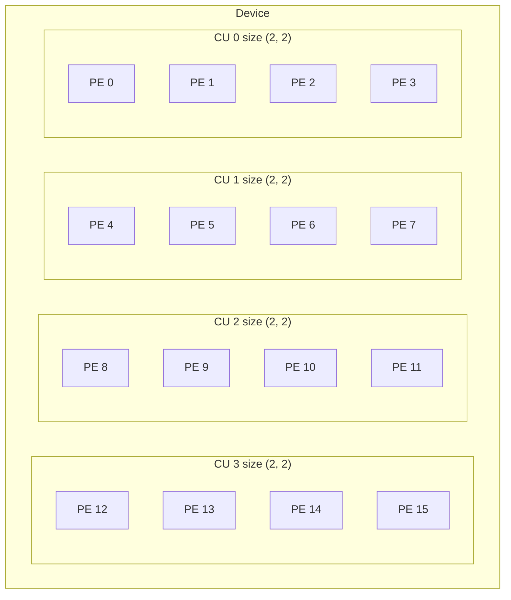
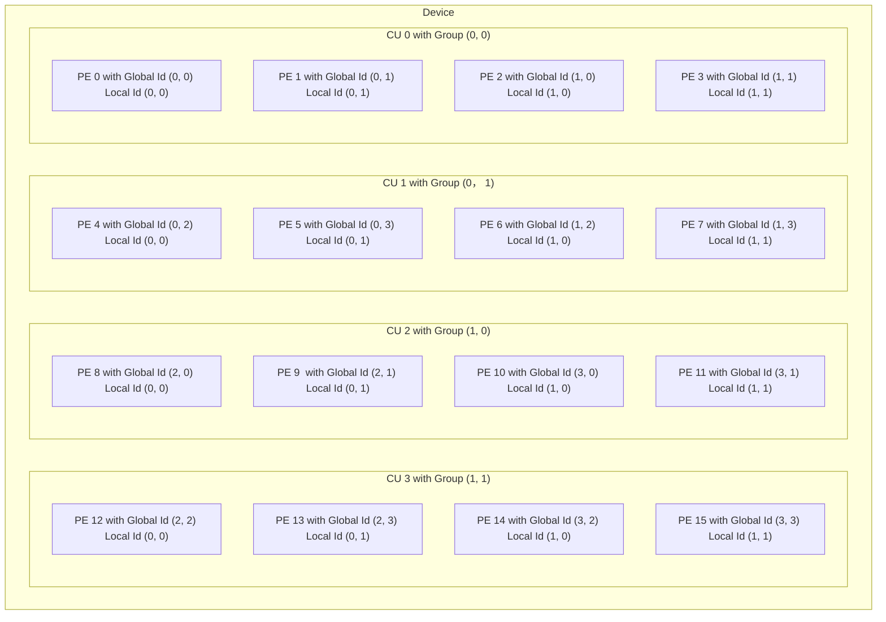
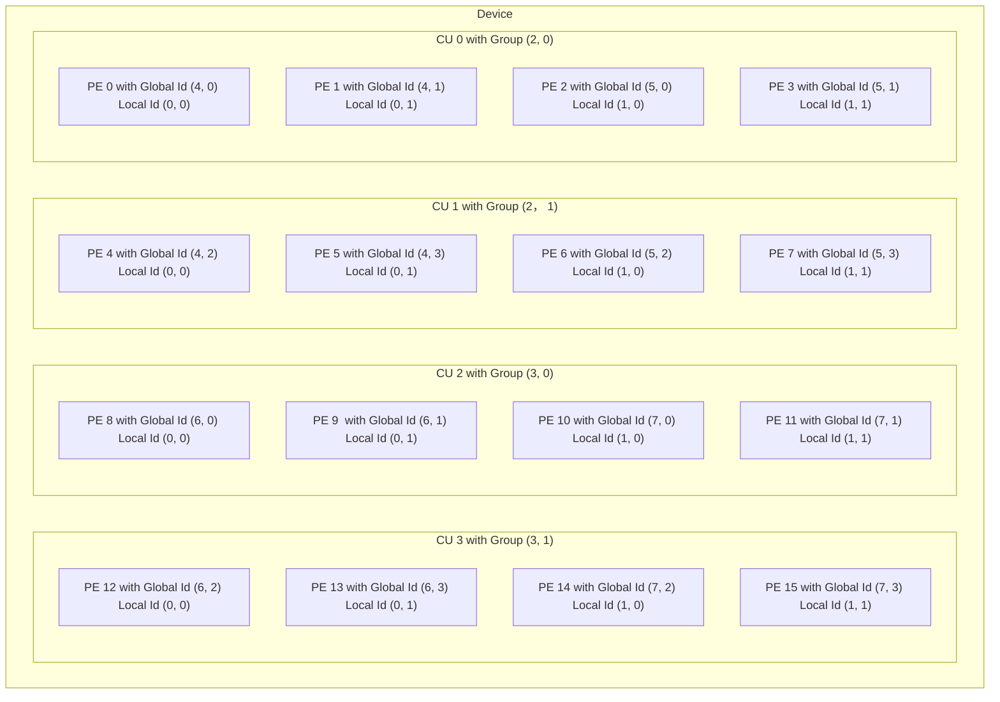

# Work Distribution

We used to just use `parallel_for` then the task is distributed magically. But for now, if we want more control, we need to know how the task is distributed.

## Work Hierarchy

### Thread or Work Item

A PE can execute a single thread at a time. It can also be called a work item.

A work item is a task that is assigned to a PE.

### Workgroup

A workgroup is a set of work item distributed to a CU.

### ND Range

A ND range is the range of work items we need. The ND here means n-dimensional.

Previously, we call `parallel_for`, the first parameter is the total number of work items, the second parameter is the kernel function. The first one is called a ND range.

## Work Distribution

Suppose we have a workload of ND Range $(a_1, a_2, a_3)$ . If we use to use the workgroup size $(b_1, b_2, b_3)$ , we can calculate that we need a total of $\frac{a_1}{b_1} \times \frac{a_2}{b_2} \times \frac{a_3}{b_3}$ work groups.

Then, a work group is distributed to each CU. If the device has no sufficient CUs, this will be done in batches until all work groups are exhausted.

For each kernel the PE get, the index of the work item is called the global id, and the index of the work group the work item belongs to is called the group id. The index of this work item in this work group is called the local id.

Please note that, the work is always distributed sequentially from the last index to the first.

## Example

The previous description is very abstract. Let's take a look at an example.

Suppose we have ND Range $(1024, 1024, 1024)$ , and our work group size is $(128, 128, 32)$.

Suppose our GPU architecture has CU size $(128, 128, 32)$ , and we have a total of 32 CUs.

- How many work groups do we need? $\frac{1024}{128} \times \frac{1024}{128} \times \frac{1024}{32} = 256$ ( $(4, 4, 32)$ ).
- How many batches do we need? $\frac{256}{32} = 8$ .
- For the first batch, what is the global id for the second PE in the first CU? $(1, 0, 0)$ . What is the local id for the second PE in the first CU? $(1, 0, 0)$ . What is the group id for the second PE in the first CU? $(0, 0, 0)$ .
- For the second batch, what is the global id for the second PE in the first CU? $(65, 0, 0)$ . What is the local id for the second PE in the first CU? $(1, 0, 0)$ . What is the group id for the second PE in the first CU? $(0, 0, 4)$ .

## Another Example

Because 3D is kind of hard to draw, let's suppose a 2D example.

Suppose we have the following device,

If we were to distribute $(8, 4)$ works on this device, for the first batch,

The second batch being,

