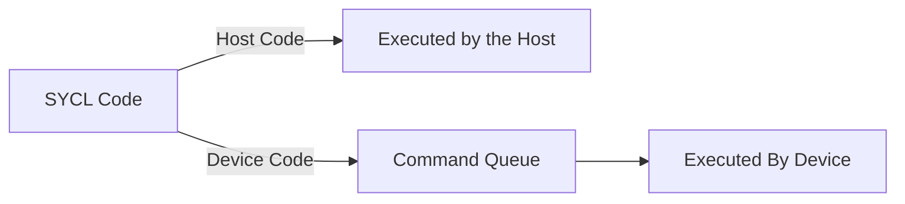
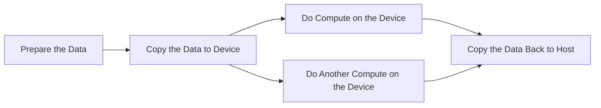

# First Step into SYCL

This note book provides introduction to parallel programming. Because this book focuses more on the algorithmic aspects of parallel programming, we use SYCL instead of OpenCL or OpenMP because SYCL is a higher level programming model that is easier to understand and use.

## What is SYCL?

SYCL is a C++ programming model that enables code for heterogeneous processors to be written in a "single-source" style using completely standard C++.

Compared with OpenCL, SYCL is a bit higher level but very easy to use.

SYCL could use OpenCL, CUDA or other backend.

## Run the First SYCL Program

You need to install the oneAPI toolkit. You can download it from the [Intel website](https://software.intel.com/content/www/us/en/develop/tools/oneapi/base-toolkit.html). Or alternatively, use AdaptiveCPP compiler. 

<details>
<summary>Docker Environment for Mac Users and Lazy People</summary>

If you are using a Mac like me, unfortunately, the oneAPI DPC++ dropped support for MacOS a while ago. Of course, you can compile and run AdaptiveCpp. But we tool kit from Intel provides more features.

Of course, you can run linux virtual machine. But an easier approach would be to use docker.

```yaml
services:
  hpc:
    image: intel/hpckit
    platform: linux/amd64
    volumes:
      - ./code:/code
    stdin_open: true
    tty: true
    command: /bin/bash
```

Then you can attach vscode to the docker and use it as your environment (Yes, Rosetta is that magical).
</details>

:::tip

If you have issue with your editor, please make sure to enable `-fsycl` flag, include the headers, and select the correct compiler. The folowing is an example for vscode.

```json
{
    "configurations": [
        {
            "name": "Linux",
            "includePath": [
                "${workspaceFolder}/**",
                "/opt/intel/oneapi/dpl/2022.6/include/pstl_offload"
            ],
            "defines": [],
            "compilerArgs": [
                "-fsycl"
            ],
            "compilerPath": "/opt/intel/oneapi/compiler/2024.2/bin/icpx",
            "intelliSenseMode": "linux-gcc-x64"
        }
    ],
    "version": 4
}
` ``

:::

We write our first program as a demonstration. You don't need to understand any of the code. Just copy paste and run it.

```cpp
#include <iostream>
#include <sycl/sycl.hpp>

class vector_addition;

int main(int, char**) {
    sycl::float4 a = { 1.0, 2.0, 3.0, 4.0 };
    sycl::float4 b = { 4.0, 3.0, 2.0, 1.0 };
    sycl::float4 c = { 0.0, 0.0, 0.0, 0.0 };

    auto device_selector = sycl::default_selector_v;

    sycl::queue queue(device_selector);
    
    std::cout << "Running on: "
              << queue.get_device().get_info<sycl::info::device::name>()
              << "\n";

    {
        sycl::buffer<sycl::float4, 1> a_sycl(&a, sycl::range<1>(1));
        sycl::buffer<sycl::float4, 1> b_sycl(&b, sycl::range<1>(1));
        sycl::buffer<sycl::float4, 1> c_sycl(&c, sycl::range<1>(1));

        queue.submit([&] (sycl::handler& cgh) {
            auto a_acc = a_sycl.get_access<sycl::access::mode::read>(cgh);
            auto b_acc = b_sycl.get_access<sycl::access::mode::read>(cgh);
            auto c_acc = c_sycl.get_access<sycl::access::mode::discard_write>(cgh);

            cgh.single_task<class vector_addition>([=] () {
                c_acc[0] = a_acc[0] + b_acc[0];
            });
        });
    }
    std::cout << "  A { " << a.x() << ", " << a.y() << ", " << a.z() << ", " << a.w() << " }\n"
              << "+ B { " << b.x() << ", " << b.y() << ", " << b.z() << ", " << b.w() << " }\n"
              << "==================\n"
              << "= C { " << c.x() << ", " << c.y() << ", " << c.z() << ", " << c.w() << " }"
              << std::endl;

    return 0;
}
```

Use the command,

```bash
icpx -fsycl ./first_step.cc
```

To compile. `icpx` is the Intel compiler. `-fsycl` is the flag to enable SYCL. The output is `a.out`. Run it with `./a.out`.

You should see the output,

```bash
Running on: VirtualApple @ 2.50GHz
  A { 1, 2, 3, 4 }
+ B { 4, 3, 2, 1 }
==================
= C { 5, 5, 5, 5 }
```

The `Running on: VirtualApple @ 2.50GHz` is the name of the device. It may vary depending on the device you are using.

If you ever learnt OpenCL before, you will find the code soothing- not as scary as OpenCL.

## Where Code Executes

Unlike OpenCL, SYCL uses a single source. So you should be clear about where your code is running on- by that, we mean, if it is running on your host computer, or the device.

:::info

By the host computer, we mean the, well, physical computer you are using. By the device, we mean a part of your computer that is capable of large parallel computation. Typically, it is GPU. But if, for example, you are using Xeon-level processors, the host and device may be the same.

In the following parts of this note, a device always refer to the device that handles large parallel computation.

:::

The host interacts with the device via command queues. This is a queue on the device that stores commands. The host can submit commands to the queue, and the device will execute them in order.

Again, SYCL is single source, thus you must know where your code is going. It is simple: If you are using SYCL specific API to order the device to do something, then it is device code. Otherwise, it is host code.

```cpp
// host code

device.submit([&] (sycl::handler& cgh) {
    cgh.host_task([=] () {
        // host code
    });
});

device.submit([&] (sycl::handler& cgh) {
    // host code
    cgh.parallel_for<class my_kernel>(range, [=] (sycl::id<1> idx) {
        // device code
    });
});

// host code
```



Device code are executed asynchronously from the host code. Thus you need synchronization if you need the result.

Host code and device code are fundamentally different. If you ever learnt OpenCL, you can tell that. Thanks to the job done by SYCL dev team, we can write modern C++ for device code. And albeit it runs, you should not use things like dynamic memory allocation, exceptions, etc. in device code. Because most of the time, the device is something like GPU that doesn't support these features.

:::info

When we debug, we usually choose CPU as the device because debugging on CPU is much easier than debugging on GPU.

:::

A command queue can be bind to a single device, but it can also be bind to multiple. We typically only select one device for a queue. When constructing the queue, use the `sycl::default_selector_v` as we did in the first program. It will select the default device. You can also use `sycl::cpu_selector_v` or `sycl::gpu_selector_v` to select CPU or GPU.

```cpp
auto device_selector = sycl::default_selector_v;
sycl::queue queue{device_selector};
```

## Action Graph

In `queue.submit`, the closure is called a command group. The command group is a lambda function that takes a `sycl::handler` as an argument. The handler is used to specify the data dependency and the access mode of the buffer.

For each command group, there can be at most one call to the device. That is, you can use host code to prepare the data in the `queue.submit`, but you can upmost call the device once- or you can fill it with host code.

:::info

There are two types of action that will require device code. Either direct device code execution, or explicit memory operation that moves data between host and device.

Common ones include,

| Work Type                     | Method | Summary                                                                                         |
|-------------------------------|---------------------------------|-------------------------------------------------------------------------------------------------|
| Device code execution          | single_task                     | Execute a single instance of a device function.                                                 |
| Device code execution                             | parallel_for                    | Multiple forms are available to launch device code with different combinations of work sizes.   |
| Explicit memory operation      | copy                            | Copy data between locations specified by accessor, pointer, and/or shared_ptr. The copy occurs as part of the SYCL task graph (described later), including dependence tracking. |
| Explicit memory operation                         | update_host                     | Trigger update of host data backing of a buffer object.                                         |
| Explicit memory operation                 | fill                            | Initialize data in a buffer to a specified value.                                               |

:::

Because each command group can only have one device call, we usually call the device multiple times so that we can complete a task. This require us to manage and schedule all the actions.

SYCL uses a directed acyclic graph (DAG) to schedule the actions and deal with data dependencies. This is called an action graph. Please note that the action can be either host code or device code. For example,



To construct such a graph in code, we use the typical async-await pattern, except that the name is event-wait.

`queue.submit` will return an `event` object (but you should receive it using `auto` because the type is long).

When you create another command group, you can use `h.depends_on(e)` to specify that the new command group depends on the previous one.

```cpp
#include <sycl/sycl.hpp>
#include <iostream>
#include <array>
using namespace sycl;
constexpr int N = 4;

int main() {
    queue q;
    int* A = malloc_shared<int>(N, q);

    std::cout << "Selected device: "
              << q.get_device().get_info<info::device::name>() << "\n";

    // Initialize values in the shared allocation
    auto eA = q.submit([&](handler& h) {
        h.parallel_for(N, [=](auto& idx) { A[idx] = idx; });
    });

    // Use a host task to output values on the host as part of
    // task graph. depends_on is used to define a dependence
    // on previous device code having completed. Here the host
    // task is defined as a lambda expression.
    q.submit([&](handler& h) {
        h.depends_on(eA);
        h.host_task([=]() {
            for (int i = 0; i < N; i++)
                std::cout << "host_task @ " << i << " = " << A[i] << "\n";
        });
    });

    // Wait for work to be completed in the queue before
    // accessing the shared data in the host program.
    q.wait();

    for (int i = 0; i < N; i++)
        std::cout << "main @ " << i << " = " << A[i] << "\n";

    free(A, q);
    return 0;
}
```

Lastly, if we want the SYCL to finish all the work. We use `q.wait()`, so that we can eventually get the result.

When writing SYCL code, you should always keep in mind that the code is running asynchronously.
